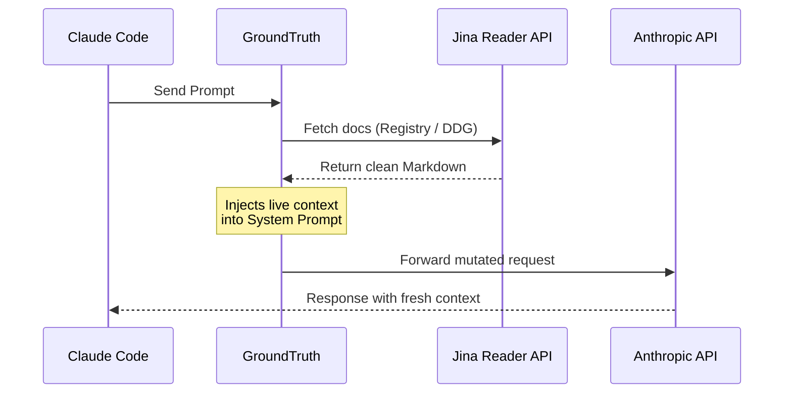
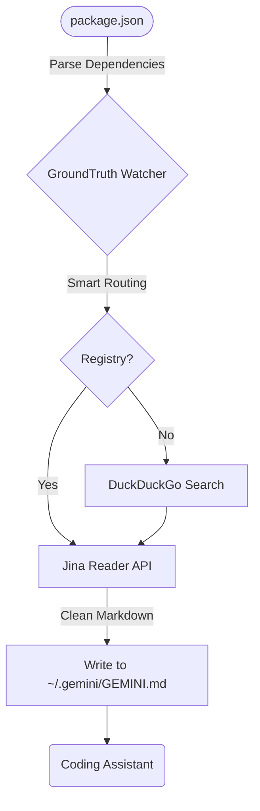

# GroundTruth

> Real-time documentation injection for AI coding agents. No config. No API keys. Just run.

[](https://www.npmjs.com/package/@antodevs/groundtruth)
[](https://www.npmjs.com/package/@antodevs/groundtruth)
[](https://github.com/anto0102/GroundTruth/stargazers)
[](LICENSE)
[](https://nodejs.org)
[](https://github.com/anto0102/GroundTruth/pulls)

---

## The Problem

AI coding assistants like Claude Code, Cursor, and Gemini have a knowledge cutoff. When you're building with Svelte 5, React 19, or any fast-moving framework, your agent is coding blind — working from stale docs that may be months or years out of date.

## The Solution

**GroundTruth** is a transparent middleware layer that fetches live documentation and injects it directly into your agent's context window before every inference. Zero config. Zero API keys. One command.

---

## Quick Start

```bash
# For Claude Code (proxy mode)
npx @antodevs/groundtruth@latest --claude-code

# For Gemini / Antigravity (file watcher mode)
npx @antodevs/groundtruth@latest --antigravity
```

That's it. GroundTruth runs in the background and handles everything automatically.

---

## How It Works

GroundTruth operates in two modes depending on your agent:

### 1. Proxy Mode — for Claude Code

Spins up a local HTTP proxy that intercepts every outbound API call to Anthropic, enriches the system prompt with fresh documentation, then forwards the mutated request.

```bash
npx @antodevs/groundtruth@latest --claude-code
# Then set: ANTHROPIC_BASE_URL=http://localhost:8080
```



### 2. Antigravity Mode — for Gemini / Antigravity

Runs as a background daemon that watches your `package.json`, fetches docs for your exact dependency versions, and writes them into `~/.gemini/GEMINI.md` automatically.

```bash
npx @antodevs/groundtruth@latest --antigravity
```



---

## The Engine

GroundTruth's context pipeline is built for precision and speed:

- **Cloudflare Worker Registry** — skips search entirely for known packages. Covers the top ~200 frameworks with hand-curated URLs and 10,000+ npm packages via automated indexing.
- **Jina Reader API** — renders JavaScript-heavy SPAs (Next.js, Svelte, Vercel AI SDK) into clean LLM-optimized Markdown.
- **DuckDuckGo Fallback** — for packages not in the registry, falls back to live web search with HTML parsing.
- **Zero-config resilience** — strict 1.5s timeout on the cloud registry. If anything fails, it silently falls back. Your agent never blocks.

---

## Installation

### Via npx (recommended — always latest)
```bash
npx @antodevs/groundtruth@latest --antigravity
npx @antodevs/groundtruth@latest --claude-code
```

### Global install
```bash
npm install -g @antodevs/groundtruth
groundtruth --antigravity
```

---

## Configuration

Create a `.groundtruth.json` in your project root for custom settings:

```json
{
  "maxChars": 4000,
  "quality": "high",
  "verbose": true,
  "sources": [
    { "url": "https://svelte.dev/docs/kit/introduction", "label": "SvelteKit Docs" },
    { "url": "https://your-internal-wiki.com/api", "label": "Internal API" }
  ]
}
```

| Option | Type | Default | Description |
|--------|------|---------|-------------|
| `maxChars` | number | `4000` | Max characters injected per context block |
| `quality` | `low` \| `medium` \| `high` | `medium` | Controls search depth and timeout budget |
| `verbose` | boolean | `false` | Enables detailed fetch logging |
| `sources` | array | `[]` | Custom URLs to always inject (internal docs, wikis, etc.) |

> **Backward compatible:** `maxTokens` is still accepted as an alias for `maxChars`.

---

## CLI Reference

| Flag | Mode | Description |
|------|------|-------------|
| `--claude-code` | Proxy | Starts HTTP proxy interceptor for Anthropic API |
| `--antigravity` | Watcher | Starts background daemon for dotfile injection |
| `--uninstall` | Cleanup | Removes `ANTHROPIC_BASE_URL` from all shell configs |
| `--port <n>` | Proxy | Proxy port (default: `8080`) |
| `--quality <level>` | Both | `low`, `medium`, or `high` (default: `medium`) |
| `--max-chars <n>` | Both | Character limit per context block (default: `4000`) |
| `--interval <n>` | Watcher | Refresh interval in minutes (default: `5`) |
| `--batch-size <n>` | Watcher | Dependencies per search batch (default: `3`) |
| `--verbose` | Both | Enable verbose logging |

---

## Comparison

| Feature | GroundTruth | Jina Reader (direct) | Crawl4AI / Playwright | Firecrawl |
|---------|:-----------:|:--------------------:|:---------------------:|:---------:|
| Setup | ✅ Zero (1 command) | ⚠️ Scripting needed | ❌ Docker + deps | ❌ API key required |
| JS Rendering | ✅ Via Jina | ✅ Yes | ✅ Yes | ✅ Yes |
| Agent Injection | ✅ Automatic | ❌ Manual | ❌ Manual | ❌ Manual |
| Works offline | ✅ Graceful fallback | ❌ No | ❌ No | ❌ No |
| Cost | ✅ Free | ⚠️ Rate limits | ✅ Free | ❌ Paid |
| Runtime size | ✅ < 1MB | — | ❌ ~200MB | — |

---

## Requirements

- Node.js v18.0.0 or higher
- Claude Code, Antigravity, or any agent that supports system prompt injection or dotfile context

---

## Contributing

Pull requests are welcome. For major changes, please open an issue first.

```bash
git clone https://github.com/anto0102/GroundTruth.git
cd GroundTruth
npm install
npm test        # run full test suite
npm run dev     # run with hot reload
```

---

## License

MIT © [Anto](https://github.com/anto0102)