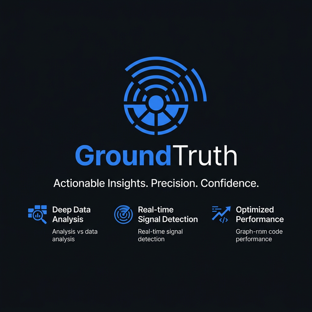
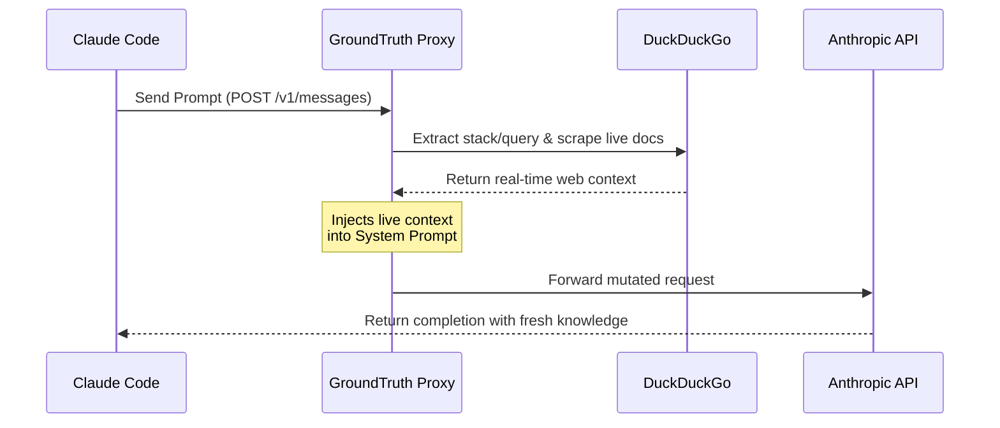
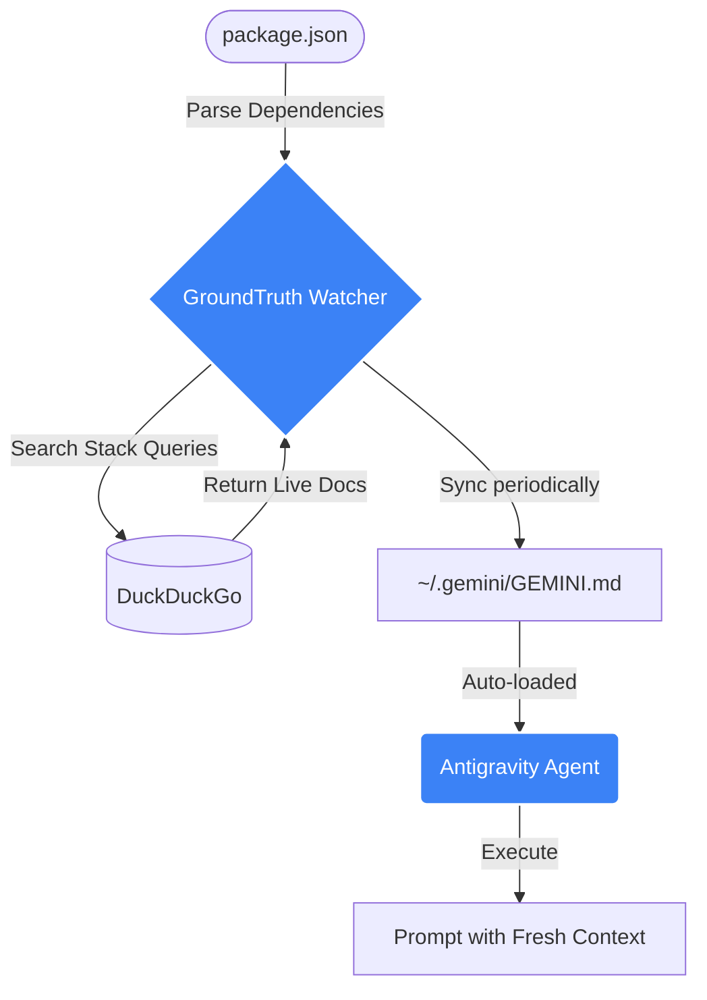

# GroundTruth

> Zero-configuration context injection layer for LLM-based coding agents.


---

## Quick Start (No Install)

Run GroundTruth instantly via `npx`:

### 1. Antigravity Mode (AI Watcher)
Recommended for automated context injection and skills-based workflows.

```bash
npx @antodevs/groundtruth --antigravity
```

### 2. Proxy Mode (Claude Code)
Intercepts outbound API calls and injects fresh documentation directly into the message payload.

```bash
npx @antodevs/groundtruth --port 8080
```

## Installation

To install globally:
```bash
npm install -g @antodevs/groundtruth
```

---

## Architecture Overview

Current-generation AI coding assistants (Claude Code, Antigravity, Cursor) suffer from deterministic knowledge cutoffs, rendering them ineffective when working with bleeding-edge frameworks (e.g., Svelte 5+, React 19). 

**GroundTruth** acts as a transparent middleware layer that resolves this by dynamically injecting real-time, stack-specific documentation directly into the agent's context window prior to inference.

---

## Architecture & Operational Mechanics

GroundTruth operates in two distinct execution modes depending on the target agent's architecture. 

### 1. Proxy Intercept Mode (Designed for `claude-code`)

In this mode, GroundTruth provisions a local HTTP proxy that intercepts outbound API calls targeting Anthropic's endpoints.



- **Query Extraction**: Parses the user prompt to identify context dependencies.
- **Data Hydration**: Orchestrates an automated DuckDuckGo search to fetch the most recent documentation. It relies on a deterministic `LRUCache`, TCP keep-alive Pool configurations, and a 429-aware `CircuitBreaker` pattern to safeguard network operations safely.
- **Payload Mutation**: Mutates the outgoing system prompt to inject the scraped live context before forwarding the request to the Anthropic completion endpoint. (It includes type-guard structures making it safe from undocumented Gemini system changes).

### 2. File Watcher Mode (Designed for `antigravity` / `gemini`)

For agents that support side-channel context ingestion via dotfiles (like Antigravity Rules), GroundTruth runs as a background daemon.



- **Stack Introspection**: Analyzes the local `package.json` to infer the project's dependency graph.
- **Intelligent Chunking**: Groups the filtered dependencies in configurable size batches (default 3) and uniquely hashes them to avoid redundant context-fetching loops unless changes are detected.
- **Automated Polling**: Periodically fetches updated documentation for the detected stack chunks in parallel.
- **State Persistence**: Hashes are serialized persistently avoiding redundant DuckDuckGo scraping operations across application crashes.
- **Block-Based Synchronization**: Writes the parsed context discretely into hash-oriented blocks inside `~/.gemini/GEMINI.md`. Native POSIX bindings and intra-device temporary files are leveraged ensuring `Atomic Writes` without EXDEV link errors. Stale contexts are efficiently garbage-collected via regex matching over tracked batch hashes.

---

## Installation & Usage

### Usage with Claude Code
```bash
# Initialize GroundTruth in proxy mode (auto-exports ANTHROPIC_BASE_URL)
npx groundtruth --claude-code

# Execute your agent in a separate TTY
claude
```
> **Note:** The daemon automatically mutates your shell environment (`~/.zshrc`, `~/.bashrc`, `~/.bash_profile`, `~/.config/fish/config.fish`) to route traffic through the localhost proxy.

### Usage with Antigravity / Gemini
```bash
cd /workspace/your-project

# Initialize the daemon in file watcher mode
npx groundtruth --antigravity
```
> **Note:** GroundTruth will continuously poll and sync documentation based on your `package.json` manifest.

---

## CLI Reference

| Flag | Mode | Technical Description |
|------|------|-------------|
| `--claude-code` | Proxy | Initializes HTTP interceptor for Anthropic API payloads. |
| `--antigravity` | Rules | Initializes background daemon for dotfile synchronization. |
| `--use-package-json` | Both | Enforces AST/manifest parsing of `package.json` for query generation. |
| `--port <n>` | Proxy | Overrides default proxy listener port (Default: `8080`). |
| `--interval <n>` | Rules | Overrides the polling interval for documentation refresh in minutes (Default: `5`). |
| `--batch-size <n>` | Rules | Changes the amount of dependencies per query chunk for block fetching (Default: `3`, Min: `2`, Max: `5`). |

---

## Benchmark & Comparison

GroundTruth is heavily optimized for zero-configuration deployments and minimal token overhead compared to existing MCP (Model Context Protocol) solutions.

| Feature | GroundTruth | Brave MCP | Playwright MCP | Firecrawl |
|---------|-------------|-----------|----------------|-----------|
| **Authentication** | None Required | API Key | None Required | API Key |
| **Token Overhead** | ~500 tokens | ~800 tokens | ~13,000 tokens | ~800 tokens |
| **Antigravity Support** | Native | Unsupported | Unsupported | Unsupported |
| **Runtime Footprint** | < 1MB | < 1MB | ~200MB | < 1MB |
| **Shell Auto-config** | Automated | Manual | Manual | Manual |

---

## System Requirements
- Node.js runtime (v18.0.0 or higher)
- Supported Agent (Antigravity or Claude Code)

---

## License
MIT
