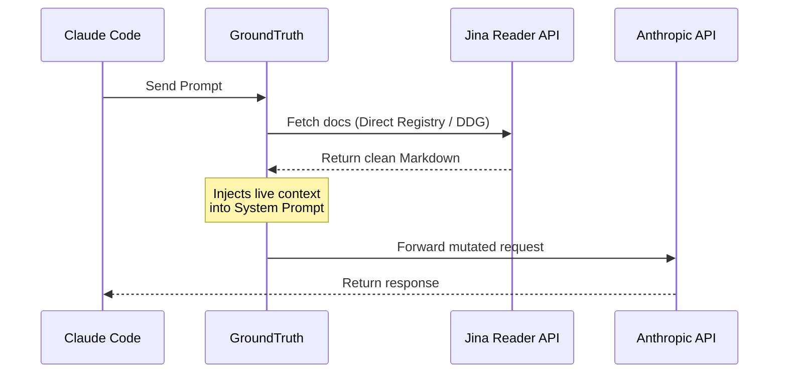

# GroundTruth

> Zero-configuration context injection layer for LLM-based coding agents.


---

## Quick Start (No Install)

Run GroundTruth instantly via `npx`:

### 1. Antigravity Mode (AI Watcher)
Recommended for automated context injection and skills-based workflows.

```bash
npx @antodevs/groundtruth --antigravity
```

### 2. Proxy Mode (Claude Code)
Intercepts outbound API calls and injects fresh documentation directly into the message payload.

```bash
npx @antodevs/groundtruth --claude-code
```

## Installation

To install globally:
```bash
npm install -g @antodevs/groundtruth
```

---

## Architecture Overview

Current-generation AI coding assistants (Claude Code, Antigravity, Cursor) suffer from deterministic knowledge cutoffs, rendering them ineffective when working with bleeding-edge frameworks (e.g., Svelte 5+, React 19). 

**GroundTruth** acts as a transparent middleware layer that resolves this by dynamically injecting real-time, stack-specific documentation directly into the agent's context window prior to inference.

### The v0.2 Engine: Global Cloud Intelligence

GroundTruth v0.2 introduces a paradigm shift in context quality and scalability:
- **Global Cloud Registry**: Bypasses search engines by querying a high-performance **Cloudflare Worker** registry. It covers the top ~200 frameworks with "Golden List" manual precision and over **10,000+ npm packages** via automated background indexing.
- **Jina Reader API Integration**: Seamlessly parses dynamic, JavaScript-rendered SPAs (like Vercel AI SDK, Next.js, and Svelte docs) into clean, LLM-optimized Markdown.
- **Automated "Gentle" Indexer**: A remote bot periodically synchronizes the latest documentation URLs from the npm ecosystem directly to the cloud registry, ensuring your context is never stale.
- **Zero-Config Resilience**: Operates locally with a strictly enforced 1.5s cloud timeout. If the registry is unreachable, it silently falls back to local Readability extraction or search.


---

## Architecture & Operational Mechanics

GroundTruth operates in two distinct execution modes depending on the target agent's architecture. 

### 1. Proxy Intercept Mode (Designed for `claude-code`)

In this mode, GroundTruth provisions a local HTTP proxy that intercepts outbound API calls targeting Anthropic's endpoints.



### 2. File Watcher Mode (Designed for `antigravity` / `gemini`)

For agents that support side-channel context ingestion via dotfiles (like Antigravity Rules), GroundTruth runs as a background daemon.


---

## Configuration (`.groundtruth.json`)

You can globally or locally configure GroundTruth by creating a `.groundtruth.json` file in your directory:

```json
{
  "maxChars": 4000,
  "quality": "high",
  "verbose": true,
  "sources": [
    { "url": "https://svelte.dev/docs/kit/introduction", "label": "SvelteKit Docs" }
  ]
}
```

- **`maxChars`**: The maximum length of characters injected for a single page. 
- **`quality`**: `low`, `medium`, or `high`. Controls how many search results to retrieve and the timeout budget.
- **`sources`**: Useful for custom, internal, or highly specific documentation that GroundTruth should always inject.

---

## CLI Reference

| Flag | Mode | Technical Description |
|------|------|-------------|
| `--claude-code` | Proxy | Initializes HTTP interceptor for Anthropic API payloads. |
| `--antigravity` | Rules | Initializes background daemon for dotfile synchronization. |
| `--uninstall` | Cleanup | Removes `ANTHROPIC_BASE_URL` from all shell config files. |
| `--port <n>` | Proxy | Overrides default proxy listener port (Default: `8080`). |
| `--quality <level>`| Both | `low`, `medium`, or `high` quality preset (Default: `medium`). |
| `--max-chars <n>` | Both | Modifies the character limit per injected context block (Default: `4000`). |
| `--interval <n>` | Rules | Overrides the polling interval for documentation refresh in minutes (Default: `5`). |
| `--batch-size <n>` | Rules | Changes the amount of dependencies per query chunk for block fetching. |
| `--verbose` | Both | Enables verbose logging output. |

---

## Benchmark & Comparison

GroundTruth is optimized for zero-configuration deployments and minimal token overhead compared to existing MCP solutions.

| Feature | GroundTruth | Jina Reader (Direct) | Crawl4AI / Playwright | Firecrawl |
|---------|-------------|----------------------|-----------------------|-----------|
| **Setup Required** | None (1 command) | Scripting needed | High (Docker/Deps) | High (API Key) |
| **JS Rendering** | ✅ Yes (via Jina) | ✅ Yes | ✅ Yes | ✅ Yes |
| **Agent Injection** | ✅ Auto (Proxy/File) | ❌ Manual integration | ❌ Manual integration | ❌ Manual integration |
| **Cost** | Free | Rate limits apply | Free | Paid |
| **Runtime Footprint** | < 1MB | N/A | ~200MB | N/A |

---

## System Requirements
- Node.js runtime (v18.0.0 or higher)
- Supported Agent (Antigravity or Claude Code)

---

## License
MIT
