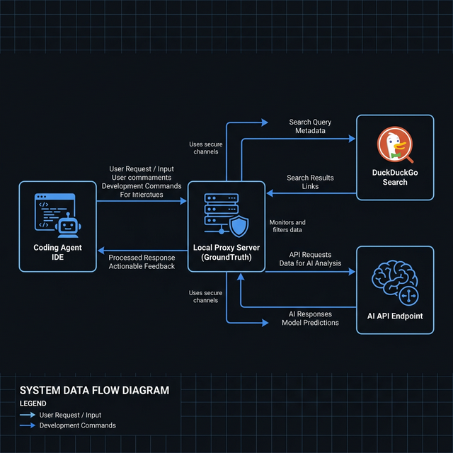

# GroundTruth

> Live web context for coding agents. Zero API keys. Zero setup.


---

## The Problem
Every AI coding agent — Claude Code, Antigravity, Cursor — has a knowledge cutoff. Ask about React 19 or SvelteKit 2.5 and you get outdated answers. GroundTruth fixes this.

---

## How it Works



### Claude Code (proxy mode)
```
Your prompt
    │
    ▼
GroundTruth proxy (localhost:8080)
    │  extracts query → searches DuckDuckGo
    │  injects fresh docs into system prompt
    ▼
api.anthropic.com → Claude
    │
    ▼
Answer with live context ✓
```

### Antigravity / Gemini (rules mode)
```
GroundTruth (background watcher)
    │  reads package.json → detects your stack
    │  searches DuckDuckGo every 5 min
    │  writes fresh context to ~/.gemini/GEMINI.md
    ▼
Antigravity reads GEMINI.md automatically
    │
    ▼
Every prompt has live context ✓
```

---

## Install & Setup

### Claude Code
```bash
# Start GroundTruth (auto-configures ANTHROPIC_BASE_URL)
npx groundtruth --claude-code

# Start Claude Code in another terminal
claude
```
> GroundTruth automatically writes ANTHROPIC_BASE_URL to your shell config (`~/.zshrc`, `~/.bashrc`, `config.fish`). No manual setup needed.

### Antigravity / Gemini
```bash
# Run from your project root
cd your-project
npx groundtruth --antigravity
```
> GroundTruth reads your `package.json`, detects your stack, and keeps `~/.gemini/GEMINI.md` updated with fresh docs.

---

## Options

| Flag | Mode | Description |
|------|------|-------------|
| `--claude-code` | Proxy | Intercepts Anthropic API calls |
| `--antigravity` | Rules | Writes to GEMINI.md watcher |
| `--use-package-json` | Both | Use `package.json` as search query |
| `--port <n>` | Proxy | Custom port (default: `8080`) |
| `--interval <n>` | Rules | Refresh interval in minutes (default: `5`) |

---

## How it Compares

| | GroundTruth | Brave MCP | Playwright MCP | Firecrawl |
|-|-------------|-----------|----------------|-----------|
| API Key required | ✅ No | ❌ Yes | ✅ No | ❌ Yes |
| Token overhead | ~500 tok | ~800 tok | ~13.000 tok | ~800 tok |
| Works with Antigravity | ✅ Yes | ❌ No | ❌ No | ❌ No |
| Bundle size | < 3MB | < 1MB | ~200MB | < 1MB |
| Auto-configures shell | ✅ Yes | ❌ No | ❌ No | ❌ No |

---

## Requirements
- Node.js 18+
- Chrome/Chromium installed (for `--claude-code` mode)
- Antigravity or Claude Code

---

## License
MIT
